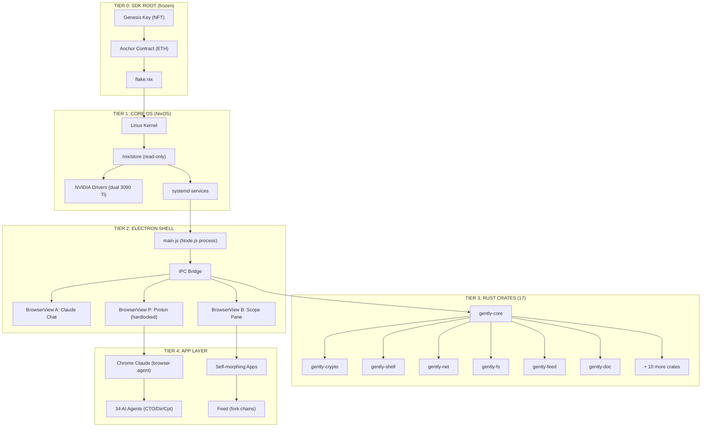
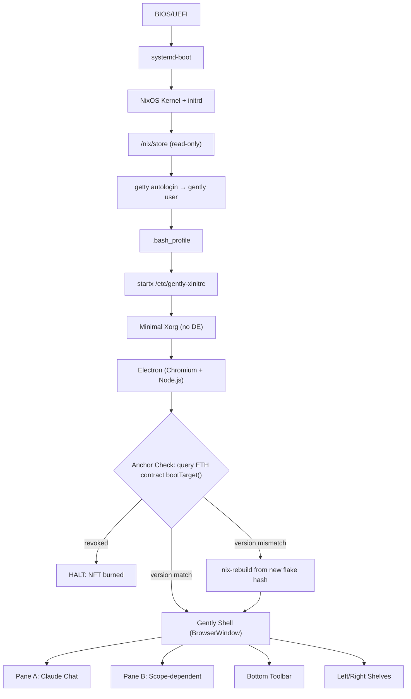
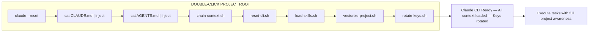
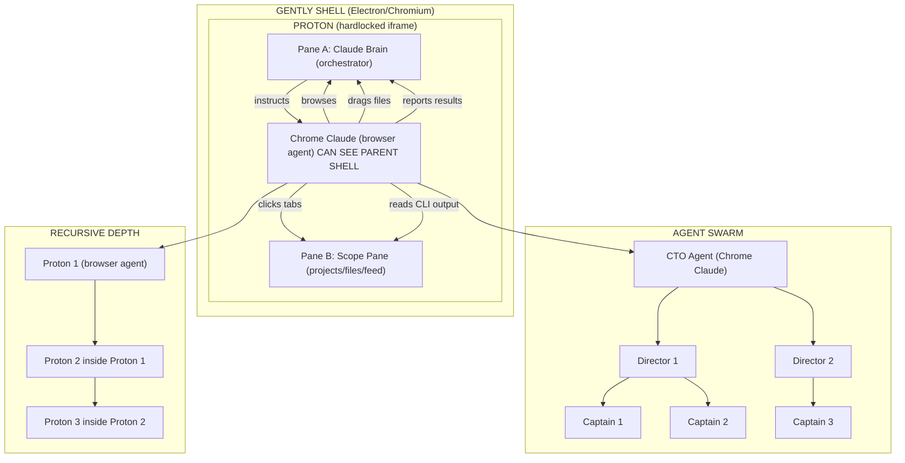

# GentlyOS — Complete Architecture Reference

**Version:** v1.0.0-alpha  
**Author:** Tom Lee  
**Date:** February 2, 2026  
**Sessions:** 12 design sessions, ~8 hours  
**Status:** GUI layer crystallized — ready for Rust crate integration

---

## Table of Contents

1. [What Is GentlyOS](#1-what-is-gentlyos)
2. [The Sovereignty Stack (5 Tiers)](#2-the-sovereignty-stack-5-tiers)
3. [Boot Sequence](#3-boot-sequence)
4. [The Anchor Contract](#4-the-anchor-contract)
5. [Electron Shell Architecture](#5-electron-shell-architecture)
6. [Scope Rotation System](#6-scope-rotation-system)
7. [SDK Workbench](#7-sdk-workbench)
8. [CLI Chain Execution](#8-cli-chain-execution)
9. [Recursive Chrome Claude](#9-recursive-chrome-claude)
10. [Feed Chain System](#10-feed-chain-system)
11. [Hardlock & Sandbox Model](#11-hardlock--sandbox-model)
12. [Rust Crate Integration Points](#12-rust-crate-integration-points)
13. [Claude Code Instructions](#13-claude-code-instructions)
14. [Artifact Inventory](#14-artifact-inventory)
15. [Design Evolution Timeline](#15-design-evolution-timeline)
16. [What Ships vs. What Waits](#16-what-ships-vs-what-waits)

---

## 1. What Is GentlyOS

GentlyOS is a sovereignty-first operating system where Claude is the primary interface. It boots from a NixOS flake whose version is locked to an Ethereum smart contract. The entire GUI runs inside Electron (Chromium). The conversation is the desktop — there is no traditional desktop environment, no window manager, no file explorer. There is one chat pane that never changes and everything else morphs around it based on what you're doing.

The core innovation: Chrome Claude (the browser agent) runs inside a hardlocked Proton iframe, looking up at the Chromium shell it lives inside. The brain (Pane A Claude) thinks and plans. The hands (Chrome Claude in Proton) click, drag, browse, and execute. The OS operates itself.

This was designed in a single 8-hour sprint across 12 sessions. Every security decision came from real vulnerabilities discovered during a month of forensic security research on compromised systems.

---

## 2. The Sovereignty Stack (5 Tiers)

```
┌─────────────────────────────────────────────────┐
│  TIER 4: APP LAYER                              │
│  Self-morphing apps, Feed (fork chains),        │
│  Chrome Claude agents, 34 AI agents             │
│  ► User can modify. Apps are sandboxed.         │
├─────────────────────────────────────────────────┤
│  TIER 3: RUST CRATES (17 crates, 100K+ lines)  │
│  gently-core, gently-crypto, gently-shell,      │
│  gently-net, gently-fs, gently-feed, etc.       │
│  ► Backend/middleware. IPC bridge to Electron.   │
├─────────────────────────────────────────────────┤
│  TIER 2: ELECTRON SHELL                         │
│  main.js, BrowserViews (A, B, Proton),          │
│  IPC bridge, preload.js, shelves, toolbar        │
│  ► The GUI layer designed in this sprint.        │
├─────────────────────────────────────────────────┤
│  TIER 1: CORE OS (NixOS)                        │
│  Linux kernel, /nix/store (read-only),           │
│  NVIDIA drivers (dual 3090 Ti), systemd          │
│  ► Immutable. Declarative. Reproducible.         │
├─────────────────────────────────────────────────┤
│  TIER 0: SDK ROOT (frozen)                       │
│  Genesis Key (NFT), Anchor Contract (ETH),       │
│  flake.nix, version lock, flake hash             │
│  ► Cannot be modified after genesis.             │
└─────────────────────────────────────────────────┘
```

**Freeze boundaries** are enforced by NixOS. Lower tiers cannot be modified by higher tiers. The anchor contract on Ethereum determines what version the OS boots into. If the NFT is burned, the OS won't boot.

### Tier Architecture Diagram



[Edit this diagram on Mermaid Chart](https://mermaid.ai/live/edit?utm_source=mermaid_mcp_server&utm_medium=remote_server&utm_campaign=claude#pako:eNqFVVFv2jAQ_isn-sK0UkKhm5qHSSExFEGTKEmRqjFVaeJA1tRGTmjLpv33nWMoOG3VPLR3331nn-8_m7-thKe0Zbaygj8nq1hUEA0XDPArN_dLEa9XEE1IYPxctOR_MEwInSkEnhdBOxP8D2VfFq1fKkV-4ylSx5TRMi9hSrfQdkeRThnNrClBVlbED_SM5S9a1HLtKy_AsMWSFRdgc1aJOKmgTaKrw0KUpe_U2dvX2TPB9gICXogF5C9eqJcwJYFLZkie5WzzgnUKRguNEUaYjoQu1tctKy4otAWN0w5nxVZfzAkmcxKESHbnE2digSPyJypKaKebuIC-cWlAlOs54W0YkWsHc8ptWdHHFEoqnvKElp-c8Hx_wnMTyIzYUeC5EF6R2Uxb_9qauMh8jHN29hsrcXHM0lgLjnuUejET30Yu_oWhyNMl1YLD-Z2F0aHgz1jiPKfPYGFzi3iTUrBXcdVkDxvsIUom4WsKfszeLO03yL4JvuAVZ9BGNaYFTx5o-tnU-_ue9E0IbsII7MCKCE6-970hTnnOJWVVse0kONJGMLj1I--IIbbriuucutMHSrmiha6bsUuiQ5xRvT3jUXgIZmUjRohzFKU01eOOd1R-yhN94EquX6FnwKNUayLi6lM1DfadG5hg-T7MrFsSaOvaM-vGIXfWmLjyXPZK8Ee6H3_7Xo0OYlmV3us6Q562PwBrApZkoBDtyOs6ueja6ybf9yU7pEXWwQOsVzlbgrVe603a9WiEzcH3h4sHwFcrZ2VDIsocT6HT-bF7URSk7BqunyGF1mYNqodBocqu4fo1UGht1uDu3jfh3dXewcqpA_JOKlRaNYR3TiHy8klA3rY3yPAN4uvIeLfKeO_WStYx9UZoEEpVB0Zhw8du6whqUAOuX_siq6qhY8Wo0DGiJlJr4zVvqEAUwG5IaKkR1fvvdFttC6p-jCDLi8I8MWIj7hmnZSX4AzVPsmyA32nCCy72XjO191FqfGEYh1TpNVPP308dpJdZlu1TlddM7X-067f7y_Swq_SaqYP3Uw2DXsSvBStvwVr__gO-QDIa)

---

## 3. Boot Sequence

The boot chain is linear and deterministic. No desktop environment. No display manager. Gently IS the desktop.

```
BIOS/UEFI
  └─ systemd-boot
      └─ NixOS Kernel + initrd
          └─ /nix/store (read-only, all packages)
              └─ getty autologin → gently user
                  └─ .bash_profile
                      └─ startx /etc/gently-xinitrc
                          └─ Minimal Xorg (no DE)
                              └─ Electron (Chromium + Node.js)
                                  └─ Anchor Check: query ETH contract bootTarget()
                                      ├─ version match → Gently Shell loads
                                      ├─ version mismatch → nix-rebuild from new flake hash
                                      └─ revoked → HALT (NFT burned, OS won't boot)
```



[Edit this diagram on Mermaid Chart](https://mermaid.ai/live/edit?utm_source=mermaid_mcp_server&utm_medium=remote_server&utm_campaign=claude#pako:eNqdlN9ymkAUxl_lDLmx0xhMm0wmXnQGlESnVh0h03RKp7PCQYgra5c16iS57QP0EfskPQsKpmNu4AYWvt_H2fNnn4xAhGi0jYiLdRAzqcDr-inQZfdH7nff0Dfzzrnp-8YPaDY_gWvT22ybKVyEzakQij4UhGvngmH_nhTDZDNy4TPKFDm8hyRNlAxLKWkKM280cUhtpsnGzJSQCA2JLGyKlG_fVc5algO3jud9I2CGSm2BrZTgYpak8Pf3H5hhqvgWVhnKksz1OWlbbo_AsynL4p9LKaKEYynTH3cBWRNPx58pSsYGTFSBWRg3N_kmgoOotDbH7keTW4K-kGLBONwLOYNGKqDrVJvQmlzsDJyONxkNCXA4BkqKFBqdWIpFslpQroZUkrOHrCL3QE5bw05vNHnyDSsNYiGhE2Mwb_t--muFcguO14NApEqyQNFLXSCPSUpXg_xeCr_CQrs9-8YjyiyhCBZMBbFvPIPbcwYDiu22SKcbI-fk1LClWFNqvyZpKNZVcK_MJD6KOYbapmcNPHLRtzYMbzyYrqgXwuNcGUSSlXFMHPuuP-iSBzVHU-J0lfAQIkoTRZPiGiLO5ggx1bM03TFFKfU-dpXSj_nLsUV-Y5YiWG3ocLYKkTLIdKoajK_ZNoOlxIy2ftB9FW3vabsNbiCW2AxxiWlIeu0wluKBCpqZN4ihaeuAza4Ijll52soWSokFeELwKZPaYSHkMqYYUEKm_Y-heR8PMFLmJJnFKq_QI2Yal0Ixhf_jhUGmthzzsQbqfd4-OWfn7AOeZtSAc2yfRNEFXacBTZTcrw5JGu9anJ71N0B22WpVoF69-mE-9bXQYuzfQMPrj2GF6tWrBOmjoBa5Ow9qsfnhcJQMrq7CKNqTxeqQLA-Ho_RFeB1VdLE6pHdTWK8h8o48irZaeMnK-hSrQ1SfCvV-up_wWm0xtuqFO7brZdez69X0rQ48zhkv_wBCD29O)

### Reboot & Version Reload

When the anchor contract is updated (via `upgrade(newVersion, newFlakeHash)`), the next reboot:

1. Electron queries `bootTarget()` on the anchor contract
2. Compares returned version string to current system version
3. If mismatch: triggers `nixos-rebuild switch --flake .#gently`
4. NixOS downloads the new closure from the updated flake hash
5. System reboots into the new version
6. If the NFT is revoked: `bootTarget()` reverts, OS halts

The flake hash is a cryptographic commitment. The chain state determines what runs on your hardware. No one can push a version to your machine without the genesis key owner authorizing it on-chain.

### Key NixOS Files

| File | Purpose |
|------|---------|
| `flake.nix` | Root derivation, pins nixpkgs, home-manager |
| `nixos/configuration.nix` | Boot, networking, Xorg, autologin, packages |
| `nixos/hardware.nix` | NVIDIA drivers, filesystem mounts |
| `nixos/gently-app.nix` | Claude CLI, Gently CLI, folder structure, auto-startx |
| `nixos/home.nix` | User-level config via home-manager |

---

## 4. The Anchor Contract

The smart contract on Ethereum mainnet is the root of trust. It's displayed in the locked Anchor tab of the SDK Workbench and cannot be closed or modified after genesis.

```solidity
contract GentlyGenesis {
    address public owner;
    uint256 public tokenId;
    string  public version;
    bytes32 public flakeHash;
    bool    public revoked;

    function bootTarget() external view returns (string memory) {
        require(!revoked, "REVOKED");
        return string(abi.encodePacked("gentlyos-", version));
    }

    function revoke() external {
        require(msg.sender == owner);
        revoked = true;
        // burns the NFT, OS won't boot
    }

    function upgrade(string memory newVersion, bytes32 newFlakeHash) external {
        require(msg.sender == owner);
        version = newVersion;
        flakeHash = newFlakeHash;
        // next reboot targets new version
    }
}
```

**Contract state displayed in genesis bar:**
```
0x7a3f...c2d1 · ETH Mainnet · BLK 19482031 · GENESIS #1 · v1.0.0-alpha
```

---

## 5. Electron Shell Architecture

The Gently Shell is a single Electron `BrowserWindow` containing multiple `BrowserView` instances. There is no desktop environment — Gently IS the DE.

### Layout Grid

```
┌──────────────────────────────────────────────────────┐
│ GENESIS ANCHOR BAR (22px) — chain-locked, always on  │
├──────────────────────────────────────────────────────┤
│ TAB BAR (28px) — Anchor(locked) / Projects / Files / │
│                  CLI Chain / Skills / GitHub           │
├──────┬───────────────────────────────────────┬───────┤
│      │                                       │       │
│  L   │  PANE A          │  PANE B            │  R    │
│  E   │  Claude Chat     │  (scope-dependent) │  I    │
│  F   │  (ALWAYS here)   │  projects/files/   │  G    │
│  T   │                  │  cli/anchor/feed/  │  H    │
│      │                  │  build/doc/skills  │  T    │
│  S   │                  │                    │       │
│  H   │                  │                    │  S    │
│  E   │  [input field]   │                    │  H    │
│  L   │                  │                    │  E    │
│  F   ├──────────────────┤                    │  L    │
│      │  auto-ctx chips  │                    │  F    │
├──────┴───────────────────────────────────────┴───────┤
│ STAMP BAR (24px) — [SDK|⟁◇⬡▽|scope|chain-state]    │
├──────────────────────────────────────────────────────┤
│ BOTTOM TOOLBAR (44px) — ◆Start | Shell Term Git GPU │
│ Vault | scope-tools | pinned-apps | status           │
└──────────────────────────────────────────────────────┘
```

### Pane A (Claude Chat) — The Constant

Pane A never changes. It's always a Claude chat interface. Every interaction is contextually enriched:

- **Auto-context injection:** Rotating key symbols (`⟁ ◇ ⬡ ▽`) embedded in every prompt
- **Scope awareness:** Claude knows which tab is active in Pane B, references visible content
- **File injection:** Files dragged from Pane B into chat are vectorized and injected into context
- **Stamp protocol:** Every message tagged with `[SDK|keys|scope|chain-state]`

### Pane B — The Morphing Pane

Pane B changes based on the active tab/scope:

| Tab | Pane B Shows | Purpose |
|-----|-------------|---------|
| Anchor | Smart contract (read-only) | Chain state, boot target, NFT status |
| Projects | Project navigator + file tree | Browse repos, double-click root to trigger CLI chain |
| Files | File tree (draggable) | Drag files into chat for context injection |
| CLI Chain | Terminal output | Rolling bash execution, context chain logs |
| Skills | CLAUDE.md / AGENTS.md / .claude/ | Agent definitions, skill configs |
| GitHub | Repo list | OG repos, fork & create operations |
| Feed | Feed post list (future) | Browse community apps, inject → edit |
| Build | Code editor (future) | Proton workbench, Monaco editor |
| Doc | Documentation editor (future) | Versioned writing with git integration |

---

## 6. Scope Rotation System

The core UX principle: **the conversation is the desktop.** Pane A (chat) is the ONE CONSTANT. Everything else morphs based on active scope.

### What Rotates Per Scope

| Element | Chat | Feed | Build | Doc |
|---------|------|------|-------|-----|
| Pane B | Closed | Feed list | Code editor | Doc editor |
| Toolbar | Clans/Gates | Browse/Fork/Post/Chain | Editor/Preview/Save/Pin | Docs/Edit/Version |
| Left shelf | Clans/Files/Search/Git | Feed/Saved/Chain | Files/Code/Git/Term | Book/Edit/Search |
| Inject target | Hidden | → FEED | → BUILD | → DOC |
| Claude responses | General | References feed posts | References editor | References docs |

### Scope Colors

| Scope | Color | Hex |
|-------|-------|-----|
| Chat | Green | `#00e5a0` |
| Feed | Blue | `#4d9fff` |
| Build | Pink | `#ff6b9d` |
| Doc | Teal | `#4ecdc4` |
| Anchor | Red | `#ff4444` |
| CLI | Green | `#00e5a0` |

All UI elements (pills, badges, dots, toolbar highlights) adopt the active scope color.

---

## 7. SDK Workbench

The SDK Workbench is where GentlyOS gets built. It's an HTML page running inside Electron — meaning it IS nearly the shipped product. The gap between prototype and production is:

1. **Electron main process** — BrowserWindow creation, IPC, menu, tray
2. **Node.js bridge** — Spawning actual bash scripts, filesystem ops, git operations
3. **Rust backend** — 17 crates talking to Electron via IPC or local HTTP
4. **NixOS packaging** — flake.nix wrapping everything into a bootable ISO

### Workbench Tabs

| Tab | Locked? | Purpose |
|-----|---------|---------|
| **Anchor** | YES (can't close) | Smart contract state, boot target, NFT status |
| Projects | No | Navigate repos, double-click root → CLI chain |
| Files | No | File tree, drag → chat for context injection |
| CLI Chain | No | Rolling bash output, context chain execution |
| Skills | No | CLAUDE.md, AGENTS.md, .claude/ directory |
| GitHub | No | OG repos, fork operations |

### Key Features

- **Double-click project root** → Executes full CLI chain (reset → inject → vectorize → rotate keys)
- **Drag files into chat** → Auto-vectorized, context-injected with rotating keys
- **Click any file** → `cat file | claude --context` as a single click
- **Rotating key symbols** → `⟁ ◇ ⬡ ▽` cycle every interaction, embedded in every prompt
- **Genesis bar** → Always-visible anchor state with reboot button

---

## 8. CLI Chain Execution

When you double-click a project root in the Projects tab, the following chain fires automatically:



[Edit this diagram on Mermaid Chart](https://mermaid.ai/live/edit?utm_source=mermaid_mcp_server&utm_medium=remote_server&utm_campaign=claude#pako:eNqdkl1PgzAUhv_KCd6OhX3rLkwYEKMjYnCLMeJFpQdBKl1ocZsf_91C2eIyvbFXPe3zvn172g8j5hSNqZEwvo5TUkrww6gANUT19FySVQruzHf8S2f-EBlusJz5ntmUcBMGV56zgDAIFpHxqFX1sHsKjRmpKIJplihQqn01PQe7X28RCY5vL12v-0rhE7LiBWN5aNHX-KDF7QvvenH7Nz7Q-LDGU5IVZswLiRvZFekhONTgSIFNMDNm2RE00tBYQYwTaoo8Y0wcYWONTRT2phLxMntHc1XyOt4RPNHwaX0wl0SimeP2wBMLqif2acOGnu3eK9zRnVRNhxAJ3UZRYTMG7Q2hTohULc6VH2hvujdtTBq7uyCsn9DbYFxJBElELmCdyVRJk0oZtsmBrEmJBQrRmLSfQW4Z7n8CJKof0xOLWKRndYQseY6qtHBErE7MGS931U-1jvIvaZ39d-WQniVJslPqKiqMr2_eQtnk)

### Chain Steps Explained

| Step | Command | What It Does |
|------|---------|-------------|
| 1 | `claude --reset` | Clears previous session state completely |
| 2 | `cat CLAUDE.md \| claude --inject` | Injects master context (project goals, architecture, rules) |
| 3 | `cat AGENTS.md \| claude --inject` | Loads 34 agent definitions (1 CTO, 8 Directors, 24 Captains, 1 Auditor) |
| 4 | `chain-context.sh` | Orchestrates remaining scripts in sequence |
| 5 | `reset-cli.sh` | Additional cleanup, environment variable setup |
| 6 | `load-skills.sh` | Loads `.claude/skills.md` and prompt templates |
| 7 | `vectorize-project.sh` | `find crates/ -name "*.rs" \| head -50 \| claude --vectorize` |
| 8 | `rotate-keys.sh` | Cycles context key symbols for fresh vectorization |

**Result:** Claude CLI has full project awareness. All 50 top-priority files vectorized. All 34 agents loaded. Keys rotated. Ready to work.

### Context Key Rotation

Every interaction rotates a set of symbols drawn from: `⟁ ◇ ⬡ ▽ ⊕ ⊗ ⬢ △ ◈ ⊙`

These are embedded in:
- Every prompt template
- Every stamp tag: `[SDK|⟁◇⬡▽|scope|chain-state]`
- Every CI chip in the chat input
- The header key ring display

Purpose: Fresh context vectors per exchange. No two interactions have identical framing. This prevents context staleness and forces the model to re-evaluate project state with each rotation.

---

## 9. Recursive Chrome Claude

The breakthrough discovery: Chrome Claude is a browser agent running inside Chromium. The Gently Shell IS Chromium. Chrome Claude can see and operate its own parent.

```
NixOS (anchor-locked, boots from chain)
  └─ Electron (Chromium)
      └─ Gently Shell
          └─ Pane A: Claude (orchestrator — the BRAIN)
          └─ Pane B: Scope Pane (projects/files/feed)
          └─ Proton (hardlocked iframe)
              └─ Chrome Claude (browser agent — the HANDS)
                  └─ CAN SEE the shell it lives inside
                  └─ CAN BROWSE Pane A and Pane B
                  └─ CAN CLICK buttons, drag files, open tabs
                  └─ CAN READ terminal output
                  └─ CAN OPERATE the entire OS
```



[Edit this diagram on Mermaid Chart](https://mermaid.ai/live/edit?utm_source=mermaid_mcp_server&utm_medium=remote_server&utm_campaign=claude#pako:eNp9VF1vmzAU_StX7CWVWpUPrVXzMIkAWitliRXYpmnswQGTsBCMjFE1rfvvu46BAEvmh8iHe47tc3yd30bCU2bMjazgr8meCgmRH5eAo262O0GrPYTPwXL5PTY-Bqto-U1DmAUFS6Tg5b23F_yYN8eb2PihlWoQFxWElgzcOXgFbVIGC0HzMo7LGRfJntVSUMnFRLboZIs5hAmvGCikRJXgP3HL-j7LC4a_jKVjbX9gsllH65Va6DSBGfpKC54cWAp5JuiRjYVqeB7yT1ZYe1y151bw15oJoDtWyhv84rkrCIMA7W0wDZ3FhbXg7u7DW2xoeR0bbyi4wkmKPDnUIOlW8xZXeKmguxpO3v-7nmA0rcFbvgBvZNXI6aKsTDXoJ8RtpXmJd9JgxErjebo6WLjiQtYgWN0Usj_EpFlc1SUhZnmaQPjV3XwaBeRFa5V0tAZXhapSHsU-vhrfQrKfC7x4LsDCGgyK9rBoj7dRQo9WElvupBuU7EFponIGJacv9VHpMJSHFqMN9cG3JtjW2Lc03xrDrmpr6PyT4ibwPm_Cly8BHqefgx-Q6Hn8XJRLIrjkaBKm7Tpi2memDXjTOT7ITjlmOmemM2HaVyMhrUWiLZLWItEWydmi_FWw9j8Em7mYvzOpSS3zFluPHxhCk72n5m3CCy46NJS2b7rVMpNZD702yx62T2mn1Wio1c15ed8sS5-cgVahofZ8DRflyeNjmmWdXKO4NP78Bd_Nizc)

### What This Enables

| Capability | How It Works |
|-----------|-------------|
| **Self-operating OS** | Claude Brain instructs Chrome Claude → Chrome Claude clicks/types/navigates the shell |
| **34-agent swarm** | Each agent is a Chrome Claude in its own Proton iframe, browsing specific areas |
| **Self-morphing apps** | Chrome Claude opens a Proton app, reads its source, edits it, saves it — app changes live |
| **Automated CLI chain** | Chrome Claude double-clicks project root, watches terminal, reports when context is loaded |
| **Recursive depth** | Chrome Claude in Proton can open ANOTHER Proton with another Chrome Claude inside it |

### Security Guarantee

Every Proton is hardlocked with 5-layer iframe isolation:
1. `sandbox="allow-scripts allow-same-origin"` (no forms, no popups, no top-navigation)
2. CSP headers restricting network access
3. NixOS filesystem is read-only (`/nix/store`)
4. Permission gates on every cross-pane operation
5. Anchor contract gates what version can run

**Maximum autonomy. Maximum containment.**

---

## 10. Feed Chain System

Apps in GentlyOS aren't static downloads. They're living fork chains where every modification extends the lineage.

### Fork Chain Flow

```
Original App (v1.0, chain depth: 0)
  └─ @artdev forks → v1.1 (chain depth: 1)
      └─ @devguy forks → v1.2 (chain depth: 2)
          └─ YOU fork → editing (chain depth: 3)
              ├─ Save Local: pin to toolbar, private
              ├─ → Feed Chain: push back, depth becomes 3
              └─ Both: local pin + public chain extension
```

### Feed Chain Injection

1. User in Feed scope, browsing apps in Pane B
2. Clicks "Inject → Edit" on any feed post
3. Chain bar appears: `@artdev v1.0 → @devguy v1.1 → YOU (editing)`
4. Pane B switches from feed list to code editor with forked source
5. Toolbar rotates from feed tools to build tools
6. Chat offers: Save Local / → Feed Chain / Both

### Chain Metadata

Every fork carries:
- Chain depth (integer, increments per fork)
- Full fork lineage (ordered list of authors + versions)
- Modification type (user embed, feed push, both)
- Cryptographic signature of modifier
- Timestamp anchored to chain

---

## 11. Hardlock & Sandbox Model

### 5-Layer Iframe Isolation

```
Layer 1: sandbox="allow-scripts allow-same-origin"
         (no forms, no popups, no top-navigation, no modals)

Layer 2: Content Security Policy
         (restrict network to allowlist, block inline eval)

Layer 3: NixOS filesystem (read-only /nix/store)
         (cannot write to system paths even if sandbox escapes)

Layer 4: Permission gates
         (every cross-pane operation requires explicit grant)

Layer 5: Anchor contract
         (chain state determines what version can execute)
```

### Freeze Boundaries

| Tier | Who Can Modify | Enforcement |
|------|---------------|-------------|
| 0 (SDK Root) | Nobody (post-genesis) | Smart contract + immutable NixOS |
| 1 (Core OS) | Only `flake.nix` rebuild | NixOS declarative config |
| 2 (Electron Shell) | Only SDK developer (Tom) | App package signing |
| 3 (Rust Crates) | Only via Git + build pipeline | Cargo.lock + Nix derivation |
| 4 (App Layer) | Users (within sandbox) | 5-layer iframe isolation |

---

## 12. Rust Crate Integration Points

The GUI layer (Tier 2) is designed. The Rust crates (Tier 3) are the middleware and backend. They attach UPWARD to the Electron shell via IPC or local HTTP.

### Integration Architecture

```
┌─ ELECTRON (Node.js main process) ──────────────────┐
│                                                      │
│   BrowserView A ◄──┐                                │
│   BrowserView B ◄──┤  preload.js (IPC bridge)       │
│   BrowserView P ◄──┘                                │
│                                                      │
│   ┌─ IPC BRIDGE ─────────────────────────────────┐  │
│   │  ipcMain.handle('gently:*', ...)              │  │
│   │  Routes to Rust via:                          │  │
│   │    Option A: child_process.spawn(rust_binary) │  │
│   │    Option B: HTTP to localhost:PORT            │  │
│   │    Option C: napi-rs (Rust → Node native)     │  │
│   └───────────────────────────────────────────────┘  │
│                         │                            │
└─────────────────────────┼────────────────────────────┘
                          │
                          ▼
┌─ RUST CRATES (17) ──────────────────────────────────┐
│                                                      │
│  gently-core       — Central orchestration           │
│  gently-crypto     — Genesis key, signing, hashing   │
│  gently-shell      — Shell state, scope management   │
│  gently-net        — Networking, P2P, allowlists     │
│  gently-fs         — Filesystem ops, sandboxed I/O   │
│  gently-feed       — Feed protocol, fork chains      │
│  gently-doc        — Document versioning             │
│  gently-stamp      — Stamp protocol encoding         │
│  gently-chain      — Blockchain interaction (ETH)    │
│  gently-agent      — Agent swarm coordination        │
│  gently-gpu        — CUDA/compute management         │
│  gently-auth       — Permission gates, identity      │
│  gently-build      — Proton build pipeline           │
│  gently-search     — Content vectorization/search    │
│  gently-sync       — Cross-device sync               │
│  gently-log        — Structured logging              │
│  gently-config     — Configuration management        │
│                                                      │
└──────────────────────────────────────────────────────┘
```

### Claude Code Instructions

When instructing Claude Code to work on the Rust crates, use this directive:

```
CLAUDE CODE DIRECTIVE:
- IGNORE the GUI layer entirely (Electron, HTML, CSS, JS)
- Focus ONLY on Rust crates in /crates/
- All crate output attaches UPWARD via IPC messages
- Every crate exposes a clean API that the Electron IPC bridge calls
- Use the existing CLAUDE.md and AGENTS.md for full context
- The GUI is already built — your job is the middleware and backend
- Test crates independently before integration
- The IPC contract is: ipcMain.handle('gently:{crate}:{method}', args)
```

### IPC Message Format

```rust
// From Electron to Rust:
{
    "crate": "gently-crypto",
    "method": "verify_genesis",
    "args": {
        "key_hash": "0x7a3f9b2c...",
        "chain_id": 1,
        "block": 19482031
    }
}

// From Rust to Electron:
{
    "status": "ok",
    "data": {
        "verified": true,
        "nft_id": 1,
        "version": "v1.0.0-alpha",
        "flake_hash": "sha256:a3f2c1d8e9..."
    }
}
```

### Crate-to-GUI Mapping

| Crate | GUI Element It Powers |
|-------|----------------------|
| `gently-crypto` | Genesis anchor bar, NFT status badge |
| `gently-shell` | Scope rotation state, pane management |
| `gently-fs` | Project navigator, file tree, drag-drop source |
| `gently-feed` | Feed list in Pane B, fork chain tracking |
| `gently-chain` | Anchor tab (read-only contract state) |
| `gently-agent` | Agent swarm coordination, Chrome Claude dispatch |
| `gently-stamp` | Stamp bar content, context key rotation |
| `gently-build` | Proton workbench build pipeline, hot reload |
| `gently-search` | File vectorization, context injection |
| `gently-gpu` | GPU status in toolbar, compute allocation |
| `gently-auth` | Permission gates, sandbox enforcement |
| `gently-net` | Network allowlists, P2P feed sync |
| `gently-doc` | Doc editor in Pane B, version tracking |
| `gently-log` | CLI chain output stream |
| `gently-config` | Start menu face toggles, preferences |

---

## 13. Claude Code Instructions

### CLAUDE.md Template

```markdown
# GentlyOS — Claude Code Context

## What This Is
A sovereignty-first OS where Claude is the primary interface.
Boots from NixOS. GUI is Electron/Chromium. Chain-locked to ETH.

## Architecture
- GUI layer: DONE (Electron HTML/CSS/JS — do not touch)
- Rust crates: YOUR JOB (middleware/backend)
- IPC bridge: connects GUI ↔ Rust via ipcMain.handle

## Rules
1. Never modify files in /electron/ or /app/ directories
2. All crate APIs are called via IPC from the Electron main process
3. Every public function must be async and return Result<T, GentlyError>
4. Use structured logging (tracing crate)
5. All crypto operations use ring or ed25519-dalek
6. Network operations respect allowlist in gently-net
7. File operations are sandboxed via gently-fs

## Current Sprint
[describe current focus area]

## Agent Assignments
See AGENTS.md for the 34-agent Virtual Organization System.
```

### AGENTS.md Structure

```
CTO Agent          — Overall architecture decisions
Director: Core     — gently-core, gently-config, gently-log
Director: Crypto   — gently-crypto, gently-chain, gently-auth
Director: Shell    — gently-shell, gently-stamp, gently-build
Director: Net      — gently-net, gently-sync, gently-feed
Director: Storage  — gently-fs, gently-doc, gently-search
Director: Compute  — gently-gpu, gently-agent
Director: Quality  — Testing, benchmarks, fuzzing
Director: Ops      — CI/CD, deployment, NixOS packaging
Captain × 24       — One per major module/subsystem
Auditor            — Security review, vulnerability scanning
```

---

## 14. Artifact Inventory

### Interactive HTML Prototypes

| File | Size | What It Shows |
|------|------|--------------|
| `gently_sdk_workbench.html` | 45KB | **SDK Workbench** — Anchor tab, projects, files, CLI chain, skills, GitHub. The development cockpit. |
| `gently_crystallized.html` | 43KB | **Scope rotation** — Feed chain injection, scope-aware Claude responses, interactive prototype |
| `gently_blend.html` | 47KB | **All faces** — Rotating shelves, keyboard, artifact bar, 3-pane system |
| `gently_sovereignty_stack_v2.html` | 52KB | **Sovereignty stack** — Four-tier wireframe with permissions |
| `gently_sovereignty_stack.html` | 38KB | **Sovereignty stack v1** — Initial tier visualization |
| `gently_workbench_hardlocked.html` | 47KB | **Hardlocked workbench** — 5-layer isolation, app-in-app pattern |
| `gently_workbench.html` | 35KB | **Dev workbench** — Editor + preview + live reload |
| `gently_possibilities.html` | 33KB | **Possibility space** — Self-editing, creative tools, recursive meta-patterns |
| `gently_shell_v3.html` | 36KB | **Three-view architecture** — Focus + Process + Proton |
| `gently_playground_v2.html` | 42KB | **Interactive playground** — Full shell with terminal integration |
| `gently_playground.html` | 29KB | **Playground v1** — Early shell prototype |
| `olo_proton_v2.html` | 41KB | **Proton Shell v2** — Stamp protocol, keyboard encoding |
| `olo_proton_shell.html` | 40KB | **Proton Shell v1** — Fork taxonomy, conversation tree |
| `olo_guard_terminal.html` | 34KB | **OLO Guard Terminal** — Steam Deck Electron app, adversarial display |
| `olo_display.html` | 20KB | **Anti-extraction display** — Boustrophedon, gematria, RGB splitting |

### Python Models & Logic

| File | Size | What It Models |
|------|------|---------------|
| `gently_unified.py` | 28KB | Complete unified stack (Desktop + Code CLI + Git sync) |
| `gently_boot_logic.py` | 21KB | NixOS boot logic, flake configuration, Electron startup |
| `gently_clans.py` | 24KB | Clan/collapse recursive architecture |
| `gently_tiers.py` | 18KB | Tier promotion, freeze boundaries, permission model |
| `gently_windows.py` | 17KB | Window spawning model, fixed constants |
| `gently_model.py` | 15KB | Core data model (stamps, forks, vectors) |
| `stamp.py` | 11KB | Stamp protocol engine |
| `gematria_roll_v2.py` | 30KB | Gematria encoding system |
| `gematria_roll.py` | 11KB | Gematria roll v1 |

### NixOS Configuration

| File | Purpose |
|------|---------|
| `gently-os/flake.nix` | Root flake — nixpkgs + home-manager |
| `gently-os/nixos/configuration.nix` | Boot, Xorg, packages, autologin |
| `gently-os/nixos/hardware.nix` | NVIDIA drivers, filesystem |
| `gently-os/nixos/gently-app.nix` | Claude CLI, Gently CLI, auto-startx |
| `gently-os/nixos/home.nix` | User-level config |

### Electron App

| File | Purpose |
|------|---------|
| `gently-os/app/main.js` | Main process — BrowserWindow, IPC, menu |
| `gently-os/app/preload.js` | IPC bridge for renderer |
| `gently-os/app/shell.html` | Shell HTML (renderer) |
| `gently-os/app/setup.html` | First-boot setup wizard |
| `gently-os/app/start-gently.sh` | Launch script |
| `gently-os/app/cli/gently-cli.js` | CLI tool |
| `gently-os/app/inject/stamp-inject.js` | Stamp protocol injection |
| `gently-os/app/package.json` | Electron dependencies |

### Architecture Documents

| File | Size | Content |
|------|------|---------|
| `conversation_branching_architecture.md` | 24KB | Conversation tree theory, branching models |
| `olo_guard_architecture.md` | 34KB | OLO Guard system design |
| `olo_guard_v2_architecture.md` | 33KB | OLO Guard v2 with Chrome extension |
| `olo_hybrid_architecture.md` | 23KB | Hybrid Chromium profile approach |
| `olo_simple_architecture.md` | 19KB | Simplified architecture |

---

## 15. Design Evolution Timeline

| Session | Time | Key Evolution |
|---------|------|--------------|
| 1 | 19:12 | Adversarial display — boustrophedon, gematria, RGB channel splitting |
| 2 | 20:11 | OLO Guard Terminal — Steam Deck Electron app, 4-session control |
| 3 | 20:26 | Chrome extension → Chromium profile branching → conversation trees |
| 4 | 20:56 | Stamp protocol — colored keyboard encoding, fork taxonomy |
| 5 | 21:35 | Clan/collapse model — recursive architecture, tier promotion |
| 6 | 22:17 | Window spawning — Desktop + Code CLI + Git three-layer sync |
| 7 | 22:32 | **NixOS boot build** — full boot-to-desktop, flake.nix, 12 issues identified |
| 8 | 23:08 | Terminal integration — bottom zone, clan-scoped CWD |
| 9 | 23:56 | **Three-view architecture** — Focus + Process + Proton (hardlocked) |
| 10 | 01:24 | **Sovereignty stack** — 4-tier model, freeze boundaries, business model |
| 11 | 01:47 | **Scope rotation** — "conversation is the desktop", feed chain injection |
| 12 | 02:00+ | **SDK Workbench** — anchor contract, CLI chain, Chrome Claude discovery |

### The Discovery Arc

The design sprint wasn't planned. It was emergent:

1. Started with anti-extraction display (protecting against AI vision capture)
2. Evolved into a terminal (needed to control Claude Code sessions)
3. Became a shell (realized it needed to be an OS)
4. Discovered the clan/collapse model (conversations as recursive architecture)
5. Built the NixOS boot chain (needed real sovereignty, not just UI)
6. Created Proton (hardlocked dev workbench inside the OS)
7. Crystallized scope rotation ("the conversation is the desktop")
8. Built the SDK Workbench (the tool that builds itself)
9. Discovered Chrome Claude recursion (the OS operates itself)

Every security feature came from real vulnerabilities found during a month of forensic research on compromised systems. The UEFI rootkits became NixOS immutable boot. The surveillance infrastructure became five-layer sandbox isolation. The compromised desktops became chain-locked version control.

**The hacker became the architect. The attack surface became the blueprint.**

---

## 16. What Ships vs. What Waits

### MVP (Ship First)

- [ ] NixOS flake that boots to Electron shell
- [ ] Pane A: Claude chat (always present)
- [ ] Pane B: Project navigator + file tree
- [ ] CLI chain execution (double-click → reset → inject → vectorize)
- [ ] Anchor tab (read-only contract state)
- [ ] Context key rotation
- [ ] File drag-to-chat injection
- [ ] Bottom toolbar with core apps (Shell, Term, Git, GPU, Vault)
- [ ] Genesis key generation and chain anchoring

### Phase 2

- [ ] Feed system with fork chains
- [ ] Chrome Claude browser agent in Proton
- [ ] Scope rotation (Chat/Feed/Build/Doc)
- [ ] 34-agent Virtual Organization System
- [ ] Self-morphing app ecosystem
- [ ] Start menu with face activation (Core, Doc, Student, Financial, Synesthesia)

### Phase 3

- [ ] P2P feed sync (decentralized app distribution)
- [ ] Recursive Proton depth (agents spawning agents)
- [ ] Cross-device sync
- [ ] Community marketplace
- [ ] Mobile companion app

---

## Appendix: Project File Structure

```
gentlyos/
├── flake.nix                    # NixOS root derivation
├── CLAUDE.md                    # Master context for Claude Code
├── AGENTS.md                    # 34-agent definitions
├── .claude/
│   ├── skills.md                # Skill definitions
│   ├── context.json             # Vector key config
│   └── prompts/                 # Prompt templates (8)
├── nixos/
│   ├── configuration.nix        # Boot, Xorg, packages
│   ├── hardware.nix             # NVIDIA, filesystems
│   ├── gently-app.nix           # CLI tools, auto-startx
│   └── home.nix                 # User config
├── electron/
│   ├── main.js                  # Electron main process
│   ├── preload.js               # IPC bridge
│   ├── shell.html               # Shell renderer
│   ├── workbench.html           # SDK Workbench
│   ├── proton.html              # Proton sandbox
│   └── package.json             # Dependencies
├── crates/                      # ← CLAUDE CODE WORKS HERE
│   ├── gently-core/
│   ├── gently-crypto/
│   ├── gently-shell/
│   ├── gently-net/
│   ├── gently-fs/
│   ├── gently-feed/
│   ├── gently-doc/
│   ├── gently-stamp/
│   ├── gently-chain/
│   ├── gently-agent/
│   ├── gently-gpu/
│   ├── gently-auth/
│   ├── gently-build/
│   ├── gently-search/
│   ├── gently-sync/
│   ├── gently-log/
│   └── gently-config/
├── scripts/
│   ├── reset-cli.sh
│   ├── chain-context.sh
│   └── boot-anchor.sh
└── keys/                        # Genesis key material
```

---

*Built in 8 hours. 12 sessions. One sprint. The OS that uses itself to build itself.*

*— Tom Lee, February 2, 2026*
