# GENTLYOS — MASTER ARCHITECTURE DOCUMENT
## Self-Operating Recursive Intelligence Substrate
### Compiled February 2, 2026

---

## TABLE OF CONTENTS

1. [What GentlyOS Is](#1-what-gentlyos-is)
2. [The Full Stack](#2-the-full-stack)
3. [Boot Order & Chain Anchor](#3-boot-order--chain-anchor)
4. [The Four-Tier Sovereignty Stack](#4-the-four-tier-sovereignty-stack)
5. [Shell Architecture — Panes, Shelves, Scopes](#5-shell-architecture)
6. [The Scope System — One Chat, Everything Morphs](#6-the-scope-system)
7. [Feed Chains — Forkable App Ecosystem](#7-feed-chains)
8. [SDK Workbench — Tier 0 Dev Environment](#8-sdk-workbench)
9. [CLI Chain — Rolling Context Reload](#9-cli-chain)
10. [Chrome Claude Recursion](#10-chrome-claude-recursion)
11. [The OLO Stamp System](#11-the-olo-stamp-system)
12. [Crate Architecture — Rust Backend](#12-crate-architecture)
13. [NixOS Enforcement](#13-nixos-enforcement)
14. [Prototype Inventory](#14-prototype-inventory)
15. [Implementation Roadmap](#15-implementation-roadmap)

---

## 1. WHAT GENTLYOS IS

GentlyOS is a sovereignty-first operating system where Claude is the primary interface. It is:

- **An OS** — boots from NixOS, locked to an on-chain genesis key
- **An IDE** — the shell IS the development environment
- **An SDK** — the workbench builds apps that run inside itself
- **A marketplace** — apps flow through a forkable feed ecosystem
- **A recursive intelligence substrate** — Chrome Claude browser agents operate inside the shell they inhabit

The core philosophy: **The conversation is the desktop.** One chat pane is always present. Everything else morphs based on scope. Claude sees what you see and responds accordingly.

### Design Principles

- **Sovereignty flows down** — SDK → Core → Dev → App → Feed. Each tier controls the tier above it.
- **Apps flow up** — Feed ← App ← Dev ← Core ← SDK. Content rises through the tiers to the marketplace.
- **Freeze boundaries are filesystem-level** — NixOS `/nix/store` immutability + declarative config = architectural enforcement. Not UI cosmetics.
- **Optimization ≠ best** — True creativity emerges in gaps where optimization fails (the air-gap principle).
- **The workbench builds itself** — the SDK workbench is an HTML app running in Electron/Chromium, building HTML apps that run in Electron/Chromium.

---

## 2. THE FULL STACK

```
Layer 0: Ethereum Mainnet
  └─ Genesis Anchor Contract (NFT, revocable, version-locked)
      └─ bootTarget() returns "gentlyos-v1.0.0-alpha"
      └─ flakeHash stores sha256 of NixOS closure

Layer 1: NixOS
  └─ flake.nix (deterministic, signed, hash matches chain)
  └─ /nix/store (read-only by design)
  └─ configuration.nix (boots Electron as session manager)

Layer 2: Electron (Chromium + Node.js)
  └─ main.js (BrowserWindow creation, IPC, system tray)
  └─ preload.js (bridge between Node.js and renderer)
  └─ shell.html (the Gently Shell — loads in BrowserWindow)

Layer 3: Gently Shell (HTML/CSS/JS in Chromium)
  └─ Pane A: Claude chat (always present — the constant)
  └─ Pane B: Scope-dependent (Feed / Build / Doc / CLI / Anchor)
  └─ Left Shelf: Rotating navigation per scope
  └─ Right Shelf: Artifacts, injection targets
  └─ Bottom Toolbar: Core apps (frozen) + scope apps (rotating)
  └─ Stamp Bar: OLO metadata for every interaction
  └─ Genesis Bar: Chain anchor status, version, NFT badge

Layer 4: Proton Workbench (hardlocked iframe inside shell)
  └─ 5-layer isolation (validation, snapshot, watchdog, structural, DOM locks)
  └─ Tiny apps rendered inline in chat
  └─ Full workbench for app building
  └─ Self-morphing apps carry own Proton instance

Layer 5: Chrome Claude (browser agent inside Proton)
  └─ Can see and navigate the parent shell (Layer 3)
  └─ Executes UI actions: click, drag, type, navigate
  └─ Reports back to Pane A Claude (the orchestrator)
  └─ Multiple instances = the 34-agent Virtual Organization

Layer 6: Rust Backend (17 crates via IPC)
  └─ gently-core, gently-crypto, gently-shell, gently-net, gently-fs...
  └─ Communicates with Electron via IPC or local HTTP
  └─ Handles: cryptography, networking, filesystem ops, chain interaction
```

### Stack Relationship Diagram


---

## 3. BOOT ORDER & CHAIN ANCHOR

### Genesis Anchor Contract

The genesis key is an NFT on Ethereum Mainnet. It is:

- **Minted once** — at OS genesis
- **Revocable** — owner can burn it, which prevents the OS from booting
- **Version-locked** — `bootTarget()` returns the NixOS closure to boot
- **Flake-hash verified** — `flakeHash` stores the sha256 of the exact NixOS system closure
- **Upgradeable** — owner calls `upgrade(newVersion, newFlakeHash)` to change boot target

```solidity
contract GentlyGenesis {
    address public owner;
    uint256 public tokenId;
    string  public version;     // "v1.0.0-alpha"
    bytes32 public flakeHash;   // sha256 of NixOS closure
    bool    public revoked;

    function bootTarget() external view returns (string memory) {
        require(!revoked, "REVOKED");
        return string(abi.encodePacked("gentlyos-", version));
    }

    function revoke() external {
        require(msg.sender == owner);
        revoked = true;
        // burns the NFT — OS won't boot
    }

    function upgrade(string memory newVersion, bytes32 newFlakeHash) external {
        require(msg.sender == owner);
        version = newVersion;
        flakeHash = newFlakeHash;
        // next reboot targets new version
    }
}
```

### Boot Sequence


### Reboot Protocol

When Tom clicks "REBOOT → v1.0.0" or calls `upgrade()`:

1. Electron calls Node.js IPC → Rust `gently-crypto` crate
2. Rust queries Ethereum for current `bootTarget()` and `flakeHash`
3. Compares against local NixOS closure
4. If mismatch: `nix build .#gentlyos-iso` from verified flake
5. `nixos-rebuild switch` to new closure
6. Reboot into the chain-specified version

The chain is the source of truth. The local machine is always derivable from the chain state.

---

## 4. THE FOUR-TIER SOVEREIGNTY STACK

### Tier Overview

```mermaid
graph LR
    subgraph "TIER 0: SDK ROOT (Tom only)"
        SDK["flake.nix<br/>17 Rust crates<br/>Electron source<br/>GPG signing keys"]
    end
    subgraph "TIER 1: CORE OS (shipped to devs)"
        CORE["Gently Shell<br/>NixOS config<br/>Core apps (frozen)<br/>Design tokens"]
    end
    subgraph "TIER 2: DEVELOPER LAYER"
        DEV["Proton workbench<br/>Claude/Terminal/Git/GPU<br/>Build & publish apps"]
    end
    subgraph "TIER 3: APP LAYER"
        APP["Running apps<br/>Self-morphing<br/>Pinned to toolbar"]
    end
    subgraph "TIER 4: FEED"
        FEED["Published apps<br/>Fork chains<br/>Community"]
    end

    SDK -->|"❄ freeze: never shipped"| CORE
    CORE -->|"❄ freeze: devs can't modify OS"| DEV
    DEV -->|"❄ freeze: apps can't access dev tools"| APP
    APP -->|"❄ freeze: read-only when published"| FEED

    style SDK fill:#ff4444,color:#fff
    style CORE fill:#ff6b9d,color:#fff
    style DEV fill:#c77dff,color:#fff
    style APP fill:#00e5a0,color:#000
    style FEED fill:#4d9fff,color:#fff
```



### Tier 0: SDK Root (Tom only, never shipped)

- **Location:** Tom's 3090 rig, `~/gentlyos/`
- **Contents:** NixOS `flake.nix`, 17 Rust crates, Electron source, GPG signing keys, build system
- **Build:** `nix build .#gentlyos-iso` → deterministic, signed ISO (~4.2 GB)
- **Permissions:** Root access, source modification, signing authority
- **This is where GentlyOS gets built.** The SDK Workbench prototype IS the Tier 0 interface.

### Tier 1: Core OS (shipped to developers)

- **What ships:** Gently Shell + NixOS config + system apps + design tokens + default pinned apps
- **Core toolbar apps (frozen, cannot be removed):**
  - Shell (◆ diamond) — main interface
  - Terminal (⚙ console) — system terminal
  - Git (⑂ branch) — version control
  - GPU Monitor (▣ chip) — hardware stats
  - Vault (⛨ shield) — encrypted storage
  - Network Inspector (◎ globe) — traffic monitor
- **NixOS enforcement:**
  - `/nix/store` read-only by design
  - Core apps as system packages (only `nix-rebuild` from signed flake can change)
  - `shell.source` immutable
  - `pinnedApps.removable = false`
- **Sandbox boundaries:**
  - `allowNetwork/GPU = true`
  - `allowFS = ["/home/*/projects"]`
  - `denyFS = ["/etc", "/nix", "/boot"]`

### Tier 2: Developer Layer (devs building apps)

- **Environment:** Full Gently experience (Focus + Process + Proton)
- **Workflow:** `gently init my-app` → git repo + clan + Proton scaffold → Claude helps code → live preview → gates track features → pin locally → share/publish
- **Permissions GRANTED:** Build apps in Proton, use Claude/terminal/git/GPU, pin apps to toolbar (right of divider), publish to feed, theme their apps
- **Permissions DENIED:** Modify NixOS config, access `/etc` or `/nix/store`, edit Gently Shell source, remove core apps, change shell design tokens, modify stamp/gate mechanics

### Tier 3: App Layer (self-morphing apps, pinned, running)

- **App manifest** (`gently-app.json`): name, version, author, icon, permissions, main entry, morphable flag, source directory, stamp integration, ed25519 signature
- **Self-morphing:** Apps can open their own mini-Proton workbench to edit themselves. Three sandboxes deep: NixOS (OS-level) + hardlock (5-layer iframe) + Proton hardlock (nested inside app)
- **Toolbar:** Core apps (left of divider, frozen) + dev/user apps (right of divider, pinned)
- **Permissions:** Self-edit (if morphable), pin to toolbar, share to feed

### Tier 4: Feed + Marketplace (published apps, community)

- **Feed UI:** Browse apps with ratings, pin counts, permissions, version, author, size
- **Pin flow:** Browse → Inspect source → Pin (OS prompts for permissions) → Launch (hardlocked) → Fork (opens in your Proton)
- **Triple sandbox for morphable feed apps:**
  1. NixOS OS-level sandbox (filesystem, network, privileges)
  2. 5-layer hardlock iframe (validation, snapshot, watchdog, structural locks)
  3. Proton hardlock nested inside app (app's self-edit workbench)

### Freeze Boundary Enforcement

| Boundary | What's Frozen | Enforcement |
|---|---|---|
| SDK → Core | Source code, signing keys | Never shipped, stays on Tom's rig |
| Core → Dev | OS config, shell source, core apps | `/nix/store` read-only, no sudo, immutable system packages |
| Dev → App | Dev tools, terminal access | Sandbox boundaries, `denyFS`, iframe isolation |
| App → Feed | App source becomes read-only | Signing required, fork-to-edit model |

---

## 5. SHELL ARCHITECTURE

### Three BrowserViews

The Electron shell hosts three distinct Chromium profiles:

```
┌────────────────────────────────────────────────────────┐
│ Genesis Anchor Bar (chain-locked, always visible)      │
├──────────┬─────────────────────────────────────────────┤
│          │ Tab Bar (Anchor | Projects | Files | CLI...)│
│  Left    ├────────────────────┬────────────────────────┤
│  Shelf   │                    │                        │
│ (rotates │  PANE A            │  PANE B                │
│  per     │  Claude Chat       │  (scope-dependent)     │
│  scope)  │  ALWAYS PRESENT    │  Feed / Build / Doc /  │
│          │  The constant.     │  CLI / Anchor / Files  │
│          │                    │                        │
│          ├────────────────────┴────────────────────────┤
│          │ Stamp Bar [OLO|🌿scope|📍depth|⚡state|keys] │
├──────────┴────────────────────────────────────────────┤
│ Bottom Toolbar                                        │
│ [◆ Start] [Shell][Term][Git][GPU][Vault] | [scope..] │
└───────────────────────────────────────────────────────┘
```

### Pane A — The Constant

Always a Claude chat. Never closes. Never changes scope. The conversation is the desktop. Claude is scope-aware — when Pane B shows the feed, Claude talks about feed content. When Pane B shows the editor, Claude references the code.

### Pane B — The Shapeshifter

Changes entirely based on scope:

| Scope | Pane B Shows | Toolbar Adds | Left Shelf Shows |
|---|---|---|---|
| Chat | closed | Clans, Gates | Clans, Files, Search, Git |
| Feed | feed list with posts | Browse, Fork, Post, Chain, Saved | Feed, Saved, Chain, Search |
| Build | code editor (Proton) | Editor, Preview, Save, Pin, Publish | Files, Code, Git, Term |
| Doc | documentation editor | Docs, Edit, Version | Book, Edit, Search, Git |
| CLI | terminal output | (inherits current) | (inherits current) |
| Anchor | smart contract view (locked) | (read-only) | (read-only) |

### Squash & Stretch Panes

- Pane A fills the entire main area when Pane B is closed
- Split: Pane A (flex:1) + Pane B (flex:0.85), adjustable via drag divider
- Third context pane: browser tabs providing reference material, attached to right side
- Extension splits: Pane B can extend from Pane A content (showing detail view of something selected in A)

### Tiny App Rendering

Claude's responses contain inline rendered apps when generating interactive content:

```
┌─ RENDERED APP · DCT Coefficient Heatmap ─────────┐
│ [interactive visualization here]                   │
│                                                    │
│ [📌 Pin] [⟳ Proton] [↑ Feed] [⑃ Fork]           │
└────────────────────────────────────────────────────┘
```

Each tiny app has four lifecycle actions:
- **Pin** — adds to bottom toolbar as a persistent app
- **Proton** — opens in full workbench for editing
- **Feed** — publishes to the feed marketplace
- **Fork** — creates an editable copy

---

## 6. THE SCOPE SYSTEM

### One Chat, Everything Morphs


### Scope Switching Rules

1. **Pane A never changes** — always Claude chat
2. **Pane B content swaps entirely** — feed list / code editor / doc editor / terminal
3. **Bottom toolbar rotates** — core apps always visible, scope-specific tools appear/disappear
4. **Left shelf icons change** — navigation options match current scope
5. **Stamp bar updates** — scope identifier, depth, state, rotating keys
6. **Claude becomes scope-aware** — responses reference Pane B content

### The Feed → Build → Feed Flow

This is the critical loop:


---

## 7. FEED CHAINS

### How Feed Chains Work

Every app in the feed carries its full fork history. Forking creates a new node in the chain.

```
Original App (@artdev v1.0)
  └→ Fork (@devguy v1.1) — added dark mode
      └→ Fork (@designer v1.2) — new icon set
          └→ Fork (YOU v1.3) — adding layers
              └→ [your modifications here]
```

### Chain Operations

| Operation | Effect |
|---|---|
| **Fork** | Creates editable copy, adds node to chain |
| **Save Local** | Embeds as user-level app in your toolbar. Chain stays frozen. |
| **Push to Feed** | Extends the chain. All upstream forks see the new version available. |
| **Both** | Pins locally AND publishes. |
| **Inject → Edit** | Pulls chain into Build pane. Chain bar shows lineage. |

### Chain Data Model

```json
{
  "chain": [
    { "author": "@artdev", "version": "1.0.0", "hash": "sha256:abc...", "timestamp": "2026-01-15" },
    { "author": "@devguy", "version": "1.1.0", "hash": "sha256:def...", "parent": "sha256:abc..." },
    { "author": "@designer", "version": "1.2.0", "hash": "sha256:ghi...", "parent": "sha256:def..." }
  ],
  "source": "...",
  "manifest": { "name": "Pixel Art Editor", "morphable": true, "permissions": ["gpu"] }
}
```

---

## 8. SDK WORKBENCH — TIER 0 DEV ENVIRONMENT

The SDK Workbench is Tom's actual development environment — Tier 0. It runs as an HTML app inside Electron, and it is the tool that builds GentlyOS.

### Tab System

| Tab | Color | Purpose | Editable? |
|---|---|---|---|
| **Anchor** | 🔴 Red | Smart contract view, chain state, NFT status | NO — locked after genesis |
| **Projects** | 🟢 Green | Project navigator, double-click root = CLI chain | YES — create, fork, navigate |
| **Files** | 🔵 Blue | File browser, drag-to-chat injection | YES — drag, click to focus |
| **CLI Chain** | 🟢 Green | Rolling bash output, context chain execution | READ — output only |
| **Skills** | 🟡 Yellow | CLAUDE.md, AGENTS.md, skill definitions | YES — edit context |
| **GitHub** | 🟣 Purple | Repo navigator, tied to anchor chain | YES — git operations |

### File-to-Chat Injection

Files in the navigator are draggable. Drag a file into Pane A (Claude chat) to inject it as context:

```
[user drags flake.nix into chat]

User: [SDK|⟁◇⬡▽|file-inject] 📄 flake.nix — analyze this
Claude: Injected flake.nix into context. File vectorized with keys ⟁◇⬡▽.
        I can see its contents and relationship to the project graph.
```

This is equivalent to `cat file | claude --context` as a UI gesture.

### Project Root Double-Click = CLI Chain

Double-clicking a project's root directory triggers the full CLI chain:

```mermaid
flowchart TD
    DBLCLICK["Double-click: gentlyos/"]
    RESET["claude --reset<br/>Clear previous session"]
    CLAUDE_MD["cat CLAUDE.md | claude --inject<br/>Load master context"]
    AGENTS_MD["cat AGENTS.md | claude --inject<br/>Load 34 agent definitions"]
    CHAIN["bash scripts/chain-context.sh"]
    RESET_CLI["→ reset-cli.sh"]
    SKILLS["→ load-skills.sh"]
    VECTORIZE["→ vectorize-project.sh<br/>50 files indexed"]
    ROTATE["→ rotate-keys.sh<br/>⟁◇⬡▽ → new symbols"]
    READY["✓ Claude ready<br/>Full context loaded"]

    DBLCLICK --> RESET --> CLAUDE_MD --> AGENTS_MD --> CHAIN
    CHAIN --> RESET_CLI --> SKILLS --> VECTORIZE --> ROTATE --> READY

    style DBLCLICK fill:#00e5a0,color:#000
    style READY fill:#00e5a0,color:#000
```



---

## 9. CLI CHAIN — ROLLING CONTEXT RELOAD

### What Happens

The CLI chain is a series of bash scripts that execute in sequence to fully reload Claude's context for a project:

```bash
# 1. Reset Claude CLI
claude --reset

# 2. Inject master context
cat CLAUDE.md | claude --inject

# 3. Inject agent definitions
cat AGENTS.md | claude --inject
# Result: 1 CTO + 8 Directors + 24 Captains + 1 Auditor

# 4. Chain context scripts
bash scripts/chain-context.sh
#   → reset-cli.sh
#   → load-skills.sh (8 skill definitions)
#   → vectorize-project.sh (50+ files indexed)
#   → rotate-keys.sh (symbol rotation)

# 5. Ready
# Claude now has full project context, all agents, fresh keys
```

### Key Rotation

Every interaction rotates the context keys — symbols embedded in every prompt:

```
Interaction 1: ⟁ ◇ ⬡ ▽
Interaction 2: ⊕ ⊗ ⬢ △
Interaction 3: ◈ ⊙ ⟁ ⬡
```

These keys serve multiple purposes:
- **Context vectorization** — unique markers per interaction for retrieval
- **Prompt fingerprinting** — each exchange has a unique signature
- **Auto-injection** — keys are embedded in stamps, chat tags, and CI chips automatically
- **Session continuity** — keys link interactions in a chain

### The `ci-chip auto` System

Every chat input has auto-context chips:

```
[⚡ auto-ctx] [⟁◇⬡▽]  Ask Claude (context auto-injected)...  [↑]
```

The `auto-ctx` chip means the current project files, skills, and agent context are automatically included in every prompt without the user doing anything. The key symbols confirm which rotation is active.

---

## 10. CHROME CLAUDE RECURSION

### The Insight

Chrome Claude is Anthropic's browsing agent — it clicks things, reads pages, navigates UI. **It runs inside Chromium. The Gently Shell IS Chromium. Chrome Claude can see its own parent.**

### The Stack

```mermaid
flowchart TD
    subgraph "NixOS (anchor-locked)"
        ELECTRON["Electron (Chromium)"]
    end
    subgraph "Gently Shell"
        PANE_A["Pane A: Claude<br/>(orchestrator — the brain)"]
        PANE_B["Pane B: Scope View"]
    end
    subgraph "Proton (hardlocked iframe)"
        CHROME_CLAUDE["Chrome Claude<br/>(browser agent — the hands)"]
    end

    ELECTRON --> PANE_A
    ELECTRON --> PANE_B
    PANE_B -->|"Build scope"| CHROME_CLAUDE
    CHROME_CLAUDE -->|"sees & navigates"| PANE_A
    CHROME_CLAUDE -->|"sees & navigates"| PANE_B
    PANE_A -->|"instructs"| CHROME_CLAUDE

    style PANE_A fill:#00e5a0,color:#000
    style CHROME_CLAUDE fill:#ffd93d,color:#000
```



### What This Means

**Pane A Claude** = the brain. Thinks, plans, reasons, decomposes problems.

**Proton Chrome Claude** = the hands. Browses the shell, clicks buttons, drags files, opens tabs, runs CLI chains, reads output, reports back.

Example instruction from Pane A to Chrome Claude:
> "Go to the Projects tab, double-click gentlyos root, wait for the CLI chain to complete, then open flake.nix and drag it into my chat."

Chrome Claude executes this by navigating the actual UI.

### The 34 Agents as Chrome Claude Instances

Each agent in the Virtual Organization System is a Chrome Claude in its own Proton iframe:

| Role | Count | What They Browse |
|---|---|---|
| CTO | 1 | Architecture overview, cross-project coordination |
| Directors | 8 | Domain-specific tabs (crypto, networking, shell, etc.) |
| Captains | 24 | Individual file editing, testing, code review |
| Auditor | 1 | Security review, permission checking |

All sandboxed. All reporting to Pane A Claude. All operating inside the shell they inhabit.

### Recursion Depth

Chrome Claude in Proton can open ANOTHER Proton. With another Chrome Claude inside it. Each layer is a hardlocked iframe with a browser agent that can see and operate its parent context.

```
Shell
  └─ Proton (Chrome Claude A — clicks things in Shell)
      └─ Proton (Chrome Claude B — clicks things in Proton A)
          └─ Proton (Chrome Claude C — clicks things in Proton B)
```

The recursion is architecturally real. The sovereignty guarantee holds at every level because every Proton is hardlocked with 5-layer isolation.

### Local Inference on 3090s

```
Inference:    local (dual RTX 3090 Ti GPUs)
Execution:    local (Chrome Claude in Chromium)
Filesystem:   local (NixOS, /nix/store read-only)
Chain:        on-chain (Ethereum anchor contract)
Network:      optional (sovereign by default)
```

No cloud dependency for the inner loop. Brain and hands both run on local silicon.

---

## 11. THE OLO STAMP SYSTEM

### Stamp Format

Every interaction carries an OLO stamp:

```
[OLO|🌿{clan}|📍{depth}|⚡{state}|🔒{gates}|📌{context}|#{hash}|⏱{time}]
```

| Field | Meaning |
|---|---|
| `OLO` | Protocol identifier |
| `🌿{clan}` | Active clan/topic (e.g., `encoding-strategy`) |
| `📍{depth}` | Conversation depth within clan |
| `⚡{state}` | Current state: `OPEN`, `GATE`, `DONE`, `FROZEN` |
| `🔒{gates}` | Gate status: `A●B●C●D●E◐F●G○` (filled/half/empty) |
| `📌{context}` | Pinned context or file reference |
| `#{hash}` | Short hash for this interaction |
| `⏱{time}` | Timestamp |

### Clans and Gates

- **Clan** = a topic branch (like a git branch for conversation)
- **Gate** = a checkpoint within a clan (A through G)
- **Collapse** = merge completed clan back into main context (like git merge)
- **Freeze** = lock a clan's conclusions as immutable reference

### OLO as Routing Key

The stamp functions as a routing key across the entire system:
- Stamps are embedded in every prompt for context retrieval
- Key rotation symbols link stamps across interactions
- The stamp bar at the bottom of the shell shows the current stamp in real-time
- Stamps persist in conversation history for vector search

---

## 12. CRATE ARCHITECTURE — RUST BACKEND

### The 17 Crates

Tom has built ~100,000 lines of Rust across 17 crates. These are the middleware and backend that Claude Code should attach to the shell:

```
gentlyos/crates/
├── gently-core/       ← Core types, traits, error handling
├── gently-crypto/     ← Cryptographic operations, signing, verification
├── gently-shell/      ← Shell state management, pane orchestration
├── gently-net/        ← Networking, WebSocket, P2P
├── gently-fs/         ← Filesystem operations, sandboxing
├── gently-chain/      ← Blockchain interaction, anchor queries
├── gently-feed/       ← Feed protocol, chain management
├── gently-auth/       ← Authentication, NFT verification
├── gently-gpu/        ← GPU monitoring, inference dispatch
├── gently-vault/      ← Encrypted storage, key management
├── gently-agent/      ← Agent orchestration, Chrome Claude management
├── gently-stamp/      ← OLO stamp generation and parsing
├── gently-gate/       ← Gate tracking, clan management
├── gently-build/      ← Build system, Proton workbench backend
├── gently-search/     ← Vector search, context retrieval
├── gently-ipc/        ← IPC bridge between Rust and Electron
└── gently-config/     ← NixOS configuration management
```

### Integration Pattern


### Claude Code Instructions

**When working on Rust crates:**
- IGNORE the GUI layer entirely — it's handled by the HTML prototypes
- Focus on IPC endpoints that the shell calls
- Each crate exposes functions via `gently-ipc`
- The shell calls these through `window.gently.crypto.sign()`, `window.gently.chain.bootTarget()`, etc.
- The preload.js bridge maps JavaScript calls to IPC messages
- The Rust binary runs as a sidecar process alongside Electron

---

## 13. NIXOS ENFORCEMENT

### `flake.nix` Structure

```nix
{
  description = "GentlyOS — Sovereignty-First Operating System";

  inputs = {
    nixpkgs.url = "github:NixOS/nixpkgs/nixos-24.05";
  };

  outputs = { self, nixpkgs }: {
    nixosConfigurations.gentlyos = nixpkgs.lib.nixosSystem {
      system = "x86_64-linux";
      modules = [
        ./nixos/configuration.nix
        ./nixos/hardware.nix
        ./nixos/gently-app.nix
        ./nixos/home.nix
      ];
    };
  };
}
```

### What NixOS Guarantees

| Guarantee | Mechanism |
|---|---|
| `/nix/store` is read-only | Filesystem-level, kernel-enforced |
| Core apps can't be removed | System packages, only `nix-rebuild` from signed flake can change |
| No sudo for developers | User account has no sudo access |
| Apps can't write outside `$APP_DIR` | Sandbox environment variables + filesystem permissions |
| Rollback is always possible | NixOS generations, one command to revert |
| Builds are deterministic | Same flake.nix → same system closure, byte-for-byte |
| Chain verification | `flakeHash` on chain must match local closure hash |

### Boot-to-Desktop Path

```
NixOS boots →
  systemd starts →
    gently-backend.service (Rust binary) →
    gently-shell.service (Electron) →
      loads shell.html →
        connects to Rust via IPC →
          displays Anchor tab (chain-verified) →
            SDK Workbench ready
```

---

## 14. PROTOTYPE INVENTORY

### Interactive HTML Prototypes (open in browser)

| File | Description | Key Innovation |
|---|---|---|
| `gently_sdk_workbench.html` | **SDK Workbench — Tier 0** | Genesis anchor tab (locked), project navigator, CLI chain execution, file drag-to-chat, key rotation |
| `gently_crystallized.html` | **Scope System** | One chat + morphing pane B, scope pills, toolbar rotation, feed→build→feed flow, inject→edit |
| `gently_blend.html` | **Multi-Face OS** | Start menu with face toggles (Core/Doc/Student/Financial/Synesthesia), rotating shelves, keyboard extension, artifact bar |
| `gently_sovereignty_stack_v2.html` | **Four-Tier Stack** | Full tier visualization with wireframe icons, glow effects, freeze boundaries, feed mockup |
| `gently_sovereignty_stack.html` | **Tier Stack v1** | Earlier version with emoji icons |
| `gently_workbench_hardlocked.html` | **Hardlocked Dev Workbench** | 5-layer iframe isolation, preview/editor split, terminal Mode 3 |
| `gently_workbench.html` | **Dev Workbench v1** | Initial workbench with preview and editor |
| `gently_shell_v3.html` | **Three-Chromium Architecture** | Focus/Process/Proton BrowserViews with mode switching |
| `gently_possibilities.html` | **Possibility Space** | Example workflows showing what can be built |
| `gently_playground_v2.html` | **Interactive Playground** | Extended playground with examples |
| `gently_playground.html` | **Initial Playground** | First interactive prototype |
| `olo_proton_v2.html` | **Proton Shell v2** | Dual-pane with recursive tier promotion |
| `olo_proton_shell.html` | **Proton Shell v1** | Initial dual-pane concept |
| `olo_guard_terminal.html` | **OLO Guard Terminal** | Steam Deck control interface with 4 sessions |
| `olo_display.html` | **OLO Display** | Stamp visualization |

### Architecture Documents (markdown)

| File | Description |
|---|---|
| `olo_guard_architecture.md` | Master OLO Guard architecture — 4 sessions, Steam Deck constraints |
| `olo_guard_v2_architecture.md` | Extended architecture with clan/collapse system |
| `olo_hybrid_architecture.md` | Hybrid approach combining multiple concepts |
| `olo_simple_architecture.md` | Simplified Chromium profile = folder concept |
| `conversation_branching_architecture.md` | Git-for-conversations — timeline splits, branching, merging |

### Python Models

| File | Description |
|---|---|
| `gently_unified.py` | Unified data model for the OS |
| `gently_tiers.py` | Tier system data model |
| `gently_model.py` | Core model definitions |
| `gently_clans.py` | Clan and gate system |
| `gently_boot_logic.py` | Boot sequence logic |
| `gently_windows.py` | Window management |
| `stamp.py` | OLO stamp generation |

### NixOS Configuration (actual config files)

| File | Description |
|---|---|
| `gently-os/flake.nix` | Root NixOS flake |
| `gently-os/nixos/configuration.nix` | System configuration |
| `gently-os/nixos/hardware.nix` | Hardware-specific config |
| `gently-os/nixos/gently-app.nix` | Electron app as NixOS package |
| `gently-os/nixos/home.nix` | Home manager config |

### Electron App

| File | Description |
|---|---|
| `gently-os/app/main.js` | Electron main process |
| `gently-os/app/preload.js` | IPC bridge |
| `gently-os/app/shell.html` | Main shell HTML |
| `gently-os/app/setup.html` | First-run setup |
| `gently-os/app/package.json` | App manifest |
| `gently-os/app/start-gently.sh` | Launch script |
| `gently-os/app/cli/gently-cli.js` | CLI tool |
| `gently-os/app/inject/stamp-inject.js` | Stamp injection |

---

## 15. IMPLEMENTATION ROADMAP

### Phase 1: Local SDK (current → next 2 weeks)

**Goal:** The SDK Workbench running in Electron on Tom's 3090 rig, connected to Rust crates via IPC.


**Claude Code instructions for this phase:**
- IGNORE GUI — it exists (the HTML prototypes)
- Wire `gently-ipc` to expose Rust functions as IPC endpoints
- Implement `gently-chain` to query the Ethereum anchor contract
- Implement `gently-crypto` for signing, verification, key management
- Implement `gently-fs` for sandboxed filesystem operations
- Build `gently-agent` for Chrome Claude spawning and management
- Connect everything through `preload.js` → `window.gently.*` API

### Phase 2: Chain Anchor (weeks 2-3)

**Goal:** Genesis NFT minted, bootTarget() working, NixOS verification.

- Deploy `GentlyGenesis` contract to Ethereum mainnet
- Mint genesis NFT (#1)
- `gently-chain` crate queries contract at boot
- NixOS checks flakeHash against local closure
- Reboot cycle verified end-to-end

### Phase 3: Feed Protocol (weeks 3-4)

**Goal:** Apps can be published to and forked from the feed.

- `gently-feed` crate implements chain storage for app manifests
- Fork creates new chain node with parent reference
- Push extends chain for all downstream forks
- Feed UI connected to real data

### Phase 4: Chrome Claude Integration (weeks 4-5)

**Goal:** Browser agents operating inside the shell.

- `gently-agent` spawns headless Chromium instances in Proton iframes
- Pane A Claude can instruct Chrome Claude via structured commands
- Chrome Claude reports back through IPC
- Agent orchestration for the 34-agent Virtual Organization

### Phase 5: Public Release (week 6+)

**Goal:** Tier 1 Core OS ships as bootable ISO.

- `nix build .#gentlyos-iso` produces signed, deterministic ISO
- Developers download, flash to USB, boot into GentlyOS
- Core apps frozen, Proton workbench available
- Feed accessible, apps publishable

---

## APPENDIX A: DESIGN EVOLUTION

The architecture evolved through these conceptual stages:

```
OLO Guard (Steam Deck terminal)
  → Chromium Profiles (folder = session)
    → Dual-Pane Proton Shell (Focus + Process)
      → Recursive Tier Promotion (apps promoting upward)
        → Clan/Collapse System (topic branches)
          → Window Spawning (dynamic pane creation)
            → Unified Stack (Desktop + Code CLI + Git)
              → NixOS Boot-to-Desktop (full OS)
                → Terminal Mode 3 (inline terminal)
                  → Hardlocked Dev Workbench (5-layer iframe)
                    → Three-Chromium Architecture (Focus/Process/Proton)
                      → Four-Tier Sovereignty Stack (freeze boundaries)
                        → Scope System (one chat, everything morphs)
                          → SDK Workbench (Tier 0 dev environment)
                            → Genesis Chain Anchor (on-chain boot lock)
                              → Chrome Claude Recursion (self-operating OS)
```

Each stage absorbed and refined the previous. Nothing was thrown away — concepts composed.

---

## APPENDIX B: THE ORIGIN STORY

GentlyOS emerged from security research. Tom discovered UEFI-level rootkits, mapped surveillance infrastructure across multiple platforms, and had his own systems compromised. Every vulnerability became a design constraint:

| Attack Surface Found | GentlyOS Defense |
|---|---|
| UEFI rootkits | NixOS immutable boot anchored to chain |
| Compromised desktops | Read-only `/nix/store`, no sudo |
| Surveillance in apps | 5-layer hardlock on every iframe |
| Apps phoning home | Network allowlists, sovereign by default |
| Trust no runtime | Genesis NFT, revocable, on-chain version lock |
| Cipher exploitation | Rotating context keys, cryptographic stamping |

The hacker became the architect. The attack surface became the blueprint.

---

## APPENDIX C: GLOSSARY

| Term | Definition |
|---|---|
| **Anchor** | The genesis smart contract on Ethereum that locks the OS to a specific version |
| **Clan** | A topic branch within a conversation (like a git branch) |
| **Collapse** | Merging a completed clan back into main context |
| **Feed** | The app marketplace where published apps can be browsed, pinned, and forked |
| **Feed Chain** | The full fork history of an app, tracking every modification |
| **Focus** | Primary Claude chat pane (Pane A) |
| **Freeze Boundary** | The architectural enforcement point between tiers |
| **Gate** | A checkpoint within a clan (A through G) |
| **Genesis Key** | The NFT that anchors the OS to the blockchain |
| **Hardlock** | 5-layer iframe isolation: validation, snapshot, watchdog, structural, DOM locks |
| **OLO** | The metadata protocol for stamping every interaction |
| **Process** | Secondary Claude chat pane (Pane B in chat scope) |
| **Proton** | The hardlocked workbench for building and editing apps |
| **Scope** | The current operational mode (Chat, Feed, Build, Doc, etc.) |
| **Stamp** | The OLO metadata tag carried by every interaction |
| **Tiny App** | An inline rendered app within Claude's chat response |

---

*This document was compiled from a design session on February 1-2, 2026. The architecture described represents the complete GentlyOS vision as crystallized through iterative prototyping. All HTML prototypes are functional and can be opened in any browser.*

*The workbench builds itself. The OS uses itself. Ship it.*
